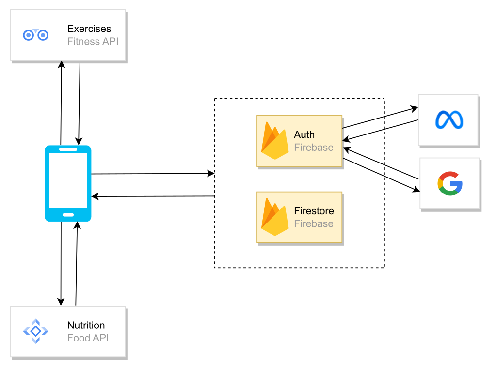

# Fit health app UI

## Description

User interface for application.

## Table of Contents

- [Techstack](#techstack)
- [Prerequisities](#prerequisities)
- [To run](#to-run)
- [Architecture](#architecture)
- [Authentication](#authentication)

## Techstack

- `React Native`

## Prerequisities

- `Node`
- `Firebase Auth`
- `Google Cloud Platform`
- `Meta for Developers`

## To run

#### Clone repository

```
git clone https://github.com/wojciechszmelczerczyk/react-native-fit-health-ui.git
```

#### Navigate to repository root directory

```sh
cd ./react-native-fit-health-ui
```

#### Install dependencies

```
npm i
```

#### Setup env variables

<details>
<summary>env</summary>

```dockerfile

# Link to API: https://rapidapi.com/edamam/api/recipe-search-and-diet/

# Food nutrition RapidAPI

FOOD_API_BASE_URL=

X_RAPIADPI_KEY=

X_RAPIADPI_HOST=

# Firebase config

FIREBASE_API_KEY=

FIREBASE_AUTH_DOMAIN=

FIREBASE_PROJECT_ID=

FIREBASE_STORAGE_BUCKET=

FIREBASE_MESSAGING_SENDER_ID=

FIREBASE_APP_ID=

FIREBASE_MEASUREMENT_ID=

# Google auth

GOOGLE_AUTH_CLIENT_ID=

# Facebook

FACEBOOK_AUTH_CLIENT_ID=

```

</details>

#### Run expo app

```
npm start
```

## Architecture

Client side architecture use `firebase authentication` to signin user.
Client communicate with third party API's. Client architecture style is `REST`.

<details>
<summary>architecture</summary>


</details>

## Authentication

User can sign in to application with:

- `user credentials` (email and password)
- `Google`
- `Facebook`
- `Apple`
